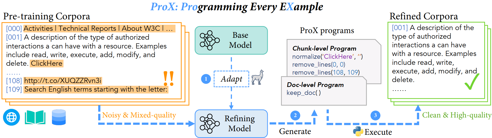

# Programming Every Example: Lifting Pre-training Data Quality Like Experts at Scale

<p align="center">
  
</p>
<a href="https://huggingface.co/gair-prox" target="_blank">
    
</a>
<a href="https://arxiv.org/abs/2409.17115" target="_blank">
    
</a>
<a href="https://gair-nlp.github.io/ProX/" target="_blank">

</a>
<a href="https://opensource.org/license/apache-2-0" target="_blank">
    
</a>
<a href="https://github.com/GAIR-NLP/ProX" target="_blank">
    
</a>
<a href="https://github.com/GAIR-NLP/ProX/issues" target="_blank">
    
</a>

## 🔥 News

- **[10 October, 2024]:** 🎉 We release the codebase for large scale data refining, together with the refining models on 🤗Huggingface: [Prox-Refining-LMs](https://huggingface.co/collections/gair-prox/prox-refining-models-6707cf820a16d830fbf434dd).
- **[19 September, 2024]:** 🎉 We open-sourced [pre-training corpus](https://huggingface.co/collections/gair-prox/prox-dataset-66e81c9d560911b836bb3704) curated by our ProX framework, containing > 100B high quality general domain corpus and ~5B high quality math corpus, together with models([ProX](https://huggingface.co/collections/gair-prox/prox-general-models-65f1674f0607712c4d6eec76) and [ProXMath](https://huggingface.co/collections/gair-prox/prox-math-models-66e92c3e5d54b27612286eb9)) trained using these data.

## Table of Contents

- [Programming Every Example: Lifting Pre-training Data Quality Like Experts at Scale](#programming-every-example-lifting-pre-training-data-quality-like-experts-at-scale)
  - [🔥 News](#-news)
  - [Table of Contents](#table-of-contents)
  - [🚀 Introduction](#-introduction)
  - [Setup](#setup)
  - [Training on ProX curated data](#training-on-prox-curated-data)
  - [Evaluation](#evaluation)
    - [General Evaluation](#general-evaluation)
    - [Math Evaluation](#math-evaluation)
  - [Projects Using ProX](#projects-using-prox)
  - [Citation](#citation)
  - [Acknowledgements](#acknowledgements)

## 🚀 Introduction

🫐 **ProX** is a lm-based data refinement framework to improve the quality of data used in pre-training large language models. Instead of relying on human experts to create rules, ProX treats data refinement like a programming task. This allows models to automatically clean and improve each data example at a large scale.


Currently, 🫐 ProX curated data have gone through 2 levels of programming + executing: doc-level and chunk-level:

**Key Features**:

- Better Performance: Models trained with ProX-refined data perform over 2% better than those trained with raw or rule-based data.
- Domain Flexibility: 🫐 ProX works well across different domains, boosting accuracy by up to 20% in tasks like math, without needing special manual adjustments.
- Efficient and Scalable: Even small models (as little as 0.3B parameters) can refine data effectively, similar to human experts, saving resources compared to LLM-based data synthesis.
- Cost-Effective: In general, 🫐 ProX could significantly save on training computing while maintaining strong results.

## Setup

First, we have to install all the libraries listed in requirements.txt

```bash
git clone https://github.com/GAIR-NLP/ProX.git prox
cd prox
conda create -n prox python=3.10
conda activate prox
pip install -r requirements.txt
```

For acceleration, we need to install flash-attention with some fused kernels:

<details>
<summary>Click me</summary>
<p>

```bash
pip install flash-attn --no-build-isolation
# this part is quite similar to TinyLlama repo
# you can also refer to its detailed guide at: https://github.com/jzhang38/TinyLlama/blob/main/PRETRAIN.md
git clone https://github.com/Dao-AILab/flash-attention.git
cd flash-attention
cd csrc/rotary && pip install .
cd ../layer_norm && pip install .
cd ../xentropy && pip install .
cd ../.. && rm -rf flash-attention
```

</p>
</details>

Then, we can install lighteval & math-eval for evaluation

<details>
<summary>
<b>lighteval</b>
</summary>
<p>

```bash
conda create -n lmeval python=3.10
git clone https://github.com/huggingface/lighteval.git
cd lighteval
pip install -e .
```

</p>
</details>

<details>
<summary>
<b>math-eval</b>
</summary>
<p>

```bash
git clone https://github.com/GAIR-NLP/math-evaluation-harness.git
cd math-evaluation-harness
conda create -n math_eval python=3.10
conda activate math_eval
pip install -r requirements.txt
```

</p>
</details>

## Large Scale Data Refining

If you want to refine your own data with ProX, please make sure you setup a new environment. 

```bash
# create a new conda env
conda create -n refining python=3.10
conda activate refining
# install requirements
pip install -r refining_requirements.txt
```

We released 2 families of refining models:

- WebRefining-LM: for general web domain, including [web-doc-refining-lm](https://huggingface.co/gair-prox/web-doc-refining-lm) and [web-chunk-refining-lm](https://huggingface.co/gair-prox/web-chunk-refining-lm)
- MathRefining-LM: for math domain, including [math-doc-refining-lm](https://huggingface.co/gair-prox/math-doc-refining-lm) and [math-chunk-refining-lm](https://huggingface.co/gair-prox/math-chunk-refining-lm)

You can refer to the following example slurm scripts to refine large scale pre-training data.

```bash
# 1. doc-level refining
sbatch scripts/data_gen/example_doc_refining.sh

# 2. chunk-level refining
sbatch scripts/data_gen/example_chunk_refining.sh
```

## Training on ProX curated data

We provide over 100B high quality general domain corpus and ~5B high quality math corpus. You can directly train your own model using these data.

Here we provide an example to download, tokenize, train a model using 🫐 ProX data with litgpt, finally with thorough evaluation.
Feel free to modify the script to fit your own needs.

First step is to setup your environment variables:

```bash
# 1. using setup_personal_env and setup_common_env
source setup_personal_env.sh
source setup_common_env.sh
```

Then you can download the data, and tokenize the data

```bash
# 2. download the data, e.g., RedPajama-pro
python scripts/data_download/hf_download.py \
    --dataset_name gair-prox/RedPajama-pro

# 3. tokenize the data
export PYTHONPATH=$PYTHONPATH:$TINYLM_WORK_DIR/train
python -m train.data_tokenize.prepare_web \
    --source_path $RAW_DATA_DIR/gair-prox/RedPajama-pro \
    --tokenizer_path $TINYLM_WORK_DIR/vocab_files/llama_hf \
    --destination_path $TOKENIZE_DATA_DIR/RedPajama-pro/llama \
    --split train \
    --percentage 1.0
```

You should see many ".bin" files in the destination path. Then you can train a model using the tokenized data.

We run the training script using slurm:

```bash
# 4. train / convert / evaluate using slurm + multiple nodes
sbatch scripts/train/tlm/pt_tlm_xs_redpj_prox.sh
```

You can also run the training script in one local node 👇

<details>
<summary>click me</summary>
<p>

```bash
# 4.1 train locally
cd train
export PYTHONPATH=$PYTHONPATH:$TINYLM_WORK_DIR/train
python -m pretrain.tinyllama \
    --config_path $TINYLM_WORK_DIR/configs/general/<your_config>.yaml

# 4.2 convert to HF model
python -m scripts.weight_conversion.batch_model_conversion \
    --litgpt_model_dir pt_llama_0_3b_redpj_25B_prox \ # the model dir you want to convert under ${$PT_MODEL_OUTPUT_DIR}
    --hf_model_dir pt_llama_0_3b_redpj_25B_prox \ # the model dir you want to save under ${HF_MODEL_OUTPUT_DIR}
    --save_token_interval 1 \ # the interval to save checkpoints, e.g., you can assume 1024 * 2048 * 500 approx. 1B token
    --arch_name tiny_LLaMA_0_3b # the model architecture name in train/lit_gpt/config.py
```

</p>
</details>

## Evaluation

### General Evaluation

We evaluate the model using lighteval across 10 standard tasks:

- ARC (ARC-Easy, ARC-Challenge)
- CommonsenseQA
- Hellaswag
- MMLU
- OpenbookQA
- PIQA
- SocialIQA
- WinoGrande
- SciQ

Actually, in sbatch script, we have already included the evaluation part. You can also run the evaluation script if you are not using slurm:

```bash
# 5. evaluate the model
# we provide scripts for general evaluation
# e.g., you only want to eval last checkpoint named as `25B`
# you can simply remove `--model_step_list 25` to evaluate all checkpoints
python -m scripts.eval.base_evaluation \
    --hf_model_dir pt_llama_0_3b_redpj_25B_prox \
    --task_impl lighteval \
    --task_set fineweb \
    --model_step_list 25
```

### Math Evaluation

For math evaluation, you can refer to the following script, after you have installed math-eval and converted the model to HF format:

```bash
# alter the work dir and activate the conda env
cd math-evaluation-harness
conda activate math_eval

# eval on all benchmarks
bash auto_dir_run.sh ${your_model_folder_path}

# summarize all results of all intermediate ckpts in your_model_folder_path
python gather_results.py --do_all_ckpts --dir_path outputs/${your_model_folder_path}
```

## Development

Currently, we release the following code and data:

- [✅] [Data](https://huggingface.co/collections/gair-prox/prox-dataset-66e81c9d560911b836bb3704)
- [✅] [Training Code](./train)
- [✅] [Evaluation Scripts](./scripts/eval)
- [✅] [Large Scale Data Refining](./scripts/data_gen)
- [✅] [Refining Model Weights](https://huggingface.co/collections/gair-prox/prox-refining-models-6707cf820a16d830fbf434dd)
- [🚧] ...

## Projects Using ProX

- [Sailor2: Sailing in South-East Asia with Inclusive Multilingual LLMs](https://sea-sailor.github.io/blog/sailor2/)
- [Scaling up Test-Time Compute with Latent Reasoning: A Recurrent Depth Approach](https://arxiv.org/abs/2502.05171)


## Citation

Please cite 🫐 ProX paper if you find our work helpful:

```bibtex
@article{zhou2024programming,
  title={Programming Every Example: Lifting Pre-training Data Quality like Experts at Scale},
  author={Zhou, Fan and Wang, Zengzhi and Liu, Qian and Li, Junlong and Liu, Pengfei},
  journal={arXiv preprint arXiv:2409.17115},
  year={2024}
}
```

## Acknowledgements

We thank the following projects that provide great help for this work:

- [🧠 TinyLlama](https://github.com/jzhang38/TinyLlama)
- [🔥 FlashAttention](https://github.com/Dao-AILab/flash-attention)
- [🧩 DataTrove](https://github.com/huggingface/datatrove)
- [🔍 LightEval](https://github.com/huggingface/lighteval)
- [🧮 MathEval](https://github.com/GAIR-NLP/math-evaluation-harness)
